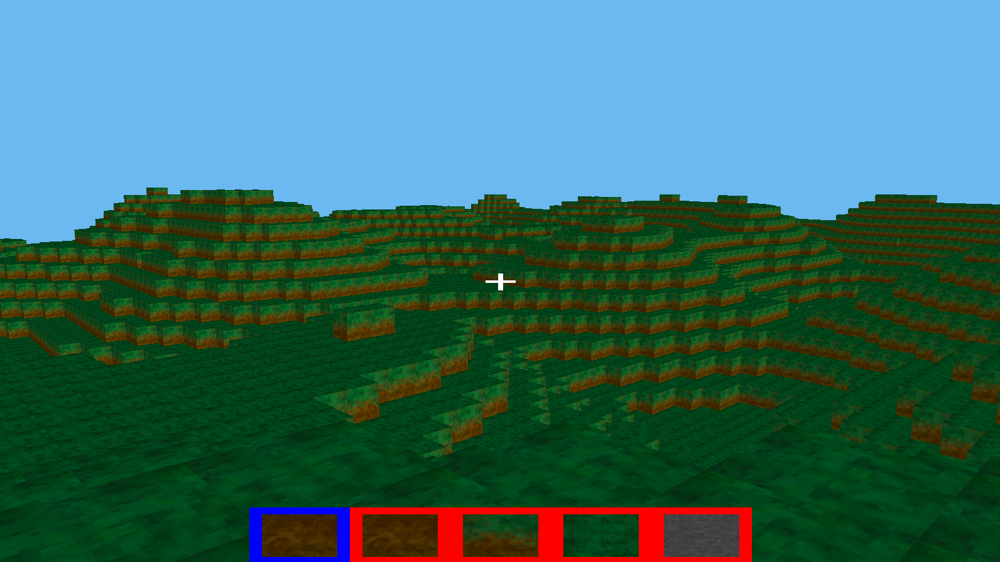
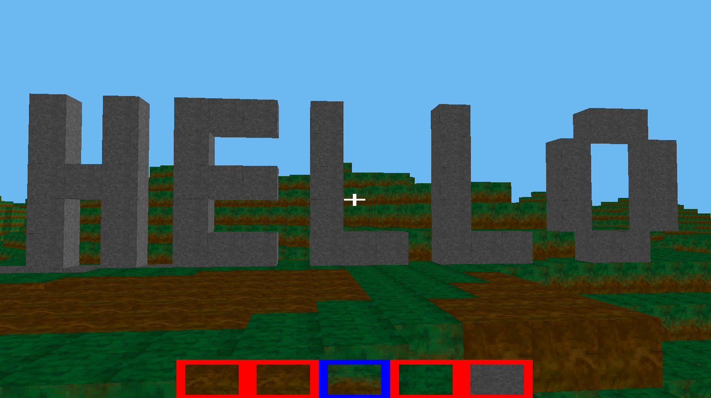

<h2>MC-OpenGL</h2>

A simple minecraft-like scene developed using OpenGL library for drawing.

Some of the functionalities include:
- Procedurally generated world using Perlin noise
- Chunk manager that stores and loads chunks of blocks as the player moves
- Dynamic chunk mesh generation (each chunk gets drawn in a single draw call, only the border blocks are included in the mesh)
- Usage of atlas textures for the blocks
- Player movement, basic physics, placing and destroying blocks

